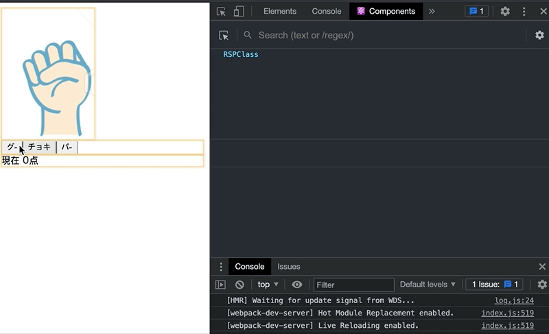
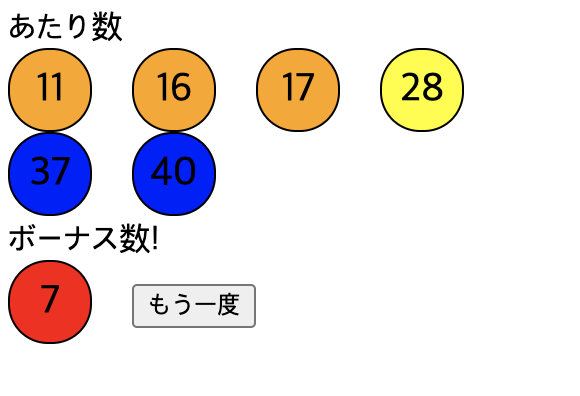
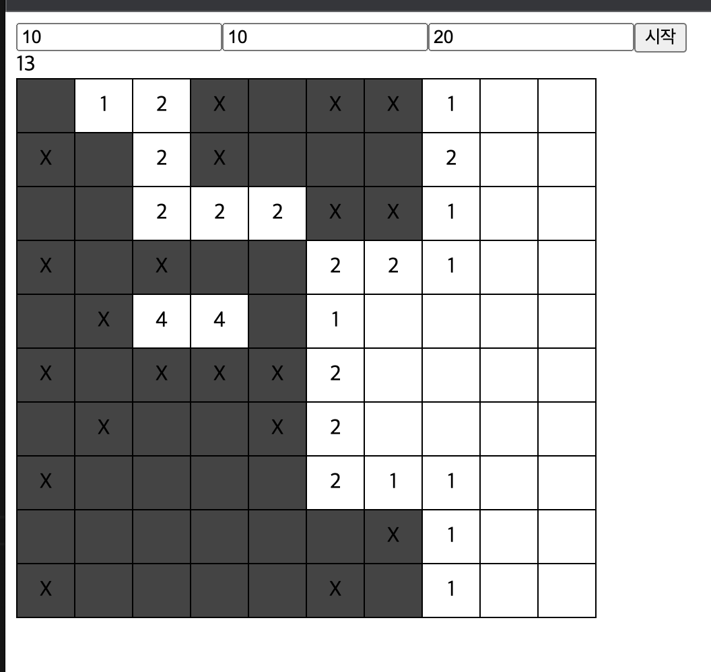

`クローム拡張プログラム => React Developer Tools`
## webpack!

`browsers:['> 5% in JP'], ` 占有率!(browserslist)
`{ "chrome": "92","ios": "14.5"}`

## 九九ゲーム
![check]pohoto/九九ゲーム.png)
## しりとり
![check]pohoto/しりとり/2.png)
## responseCheck
![check]pohoto/responseCheck/3.png)
## RSP

## lotto

## マインスイーパ

開発者は重複を取り除かなければならない。
修正事項を直したら`ビルド`を必ずしなければならない。
